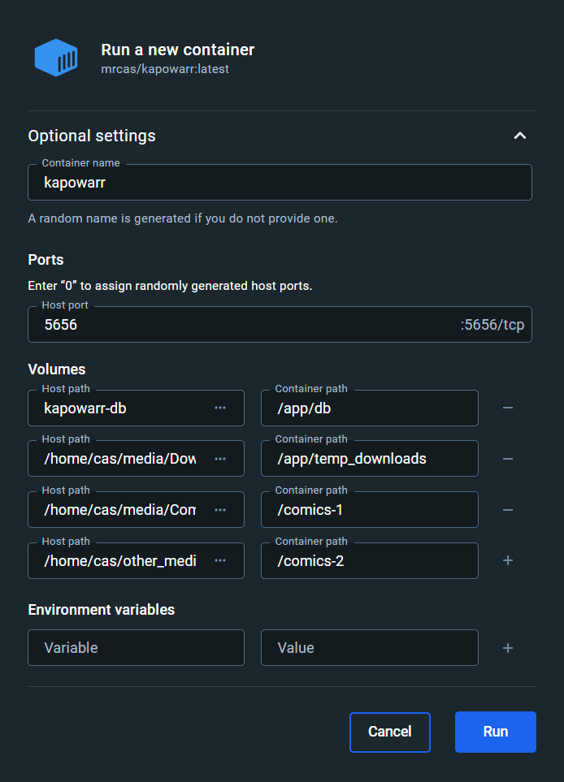

On this page, you can find instructions on how to install Kapowarr using Docker and how to update a Docker installation.

## Installation

### Install Docker

The first step is to install Docker, if you don't have it installed already. The official Docker documentation hub offers great instructions on [how to install docker CLI and Docker Desktop](https://docs.docker.com/engine/install/). Take notice of if you installed the 'Docker CLI' (the Docker documentation also calls this 'Docker CE') or if you installed 'Docker Desktop', for future instructions.

### Create Docker volume or folder

Kapowarr needs a permanent place to put the database file. This can be a [Docker volume](https://docs.docker.com/storage/volumes/), or a folder on the host machine.

=== "Docker Volume"
	=== "Docker CLI"

		```bash
		docker volume create kapowarr-db
		```

	=== "Docker Compose"

		```bash
		docker volume create kapowarr-db
		```

	=== "Docker Desktop"
		- Open `Volumes`
		- Click `Create`
		- Enter `kapowarr-db` for the name and click `Create`

=== "Local Folder"
	=== "Linux"
		Linux standards would suggest putting the folder in `/opt/application_name`, as the `/opt` directory is where program options should be stored. This is not mandatory however; you are allowed to create a folder anywhere you like. If we apply the standard to Kapowarr, the folder would be `/opt/Kapowarr/db`.

		Create the desired folder using the UI (if your distro offers this) or with the following shell command (replace `/path/to/directory` with desired path):

		```bash
		mkdir "/path/to/directory"
		```

		!!! info "Permissions and ownership"
			The permissions on this folder need to allow the container to read, write, and execute inside it. It also needs to have proper ownership. More documentation on this subject coming.

	=== "MacOS"
		MacOS standards would suggest putting the folder in `/Applications/application_name`. This is not mandatory however; you are allowed to create a folder anywhere you like. If we apply the standard to Kapowarr, the folder would be `/Applications/Kapowarr/db`.

		Create the desired folder using the UI or with the following shell command (replace `/path/to/directory` with desired path):

		```bash
		mkdir "/path/to/directory"
		```

		!!! info "Permissions and ownership"
			The permissions on this folder need to allow the container to read, write, and execute inside it. It also needs to have proper ownership. More documentation on this subject coming.

	=== "Windows"
		There is no defined standard for Windows on where to put such a folder. We suggest a path like `C:\apps\application_name`, so that it can be managed easily. This is not mandatory however; you are allowed to create a folder anywhere you like. If we apply this suggestion to Kapowarr, the folder would be `C:\apps\Kapowarr\db`.
		
		Create the desired folder either using the Windows Explorer, or using the following Powershell command:

		```powershell
		mkdir "C:\apps\Kapowarr\db"
		```

		!!! info "Permissions and ownership"
			The permissions on this folder need to allow the container to read, write, and execute inside it. It also needs to have proper ownership. More documentation on this subject coming.

### Creating root folder

Everything that Kapowarr does concerning files is done only within [root folders](../settings/mediamanagement.md#root-folders). If you don't already have a folder where all your comics are in, create one. Follow the same instructions as for [creating a local folder for the database](#create-docker-volume-or-folder), but then for your root folder.

You can create multiple root folders (on multiple drives for example). If you desire multiple root folders, repeat the steps.

!!! info "Permissions and ownership"
	Root folders require read and write permissions. More documentation on this subject coming.

### Creating download folder

Kapowarr downloads files to the ['temporary download folder'](../settings/download.md#direct-download-temporary-folder). Create a folder where Kapowarr can download to. Follow the same instructions as for [creating a local folder for the database](#create-docker-volume-or-folder), but then for your temporary download folder.

!!! info "Permissions and ownership"
	The temporary download folder requires read and write permissions. More documentation on this subject coming.

### Launch container

Now we can launch the container.

=== "Docker CLI"
	The command to get the Docker container running can be found below. But before you copy, paste and run it, read the notes below!

	=== "Linux"

		```bash
		docker run -d \
			--name kapowarr \
			-v "kapowarr-db:/app/db" \
			-v "/path/to/download_folder:/app/temp_downloads" \
			-v "/path/to/root_folder:/comics-1" \
			-p 5656:5656 \
			mrcas/kapowarr:latest
		```

	=== "MacOS"

		```bash
		docker run -d \
			--name kapowarr \
			-v "kapowarr-db:/app/db" \
			-v "/path/to/download_folder:/app/temp_downloads" \
			-v "/path/to/root_folder:/comics-1" \
			-p 5656:5656 \
			mrcas/kapowarr:latest
		```

	=== "Windows"

		```powershell
		docker run -d --name kapowarr -v "kapowarr-db:/app/db" -v "DRIVE:\with\download_folder:/app/temp_downloads" -v "DRIVE:\with\root_folder:/comics-1" -p 5656:5656 mrcas/kapowarr:latest
		```

	A few notes about this command:

	1. If you're using a folder on the host machine instead of a docker volume to store the database file ([reference](#create-docker-volume-or-folder)), replace `kapowarr-db` with the path to the host folder.  
	E.g. `"/opt/Kapowarr/db:/app/db"`.  
	E.g. `"C:\apps\Kapowarr\db:/app/db"`.

	2. Replace `/path/to/download_folder` with the path to the desired download folder, [that you created earlier](#creating-download-folder).  
	E.g. `"/home/my-user/comic-downloads:/app/temp_downloads"`.  
	E.g. `"D:\Comic-Downloads:/app/temp_downloads"`.

	3. Replace `/path/to/root_folder` with the path to the desired root folder, [that you created earlier](#creating-root-folder).  
	E.g. `"/home/my-user/comics:/comics-1"`.  
	E.g. `"D:\Comics:/comics-1"`.

	4. You can map multiple root folders by repeating `-v "/path/to/root_folder:/comics-1"` (or `-v "DRIVE:\with\root_folder:/comics-1"` for Windows) in the command, but then supplying different values for `/path/to/root_folder` and `/comics-1`.  
	E.g. `-v "/home/my-user/comics-2:/comics-2" \`.  
	E.g. `-v "E:\Comics:/comics-2"`

	5. Information on how to change the port can be found on the [Setup After Installation page](./setup_after_installation.md#port).

=== "Docker Compose"
	The contents of the `docker-compose.yml` file are below. The source file can also be found [on GitHub](https://github.com/Casvt/Kapowarr/blob/development/docker-compose.yml). But before you copy, paste and run it, read the notes below!

	```yml
	version: "3.3"
	services:
	  kapowarr:
	    container_name: kapowarr
	    image: mrcas/kapowarr:latest
	    volumes:
	      - "kapowarr-db:/app/db"
	      - "/path/to/download_folder:/app/temp_downloads"
	      - "/path/to/root_folder:/comics-1"
	    ports:
	      - 5656:5656

	volumes:
	  kapowarr-db:
	```
	
	Then run the following command to start the container. Run this command from within the directory where the `docker-compose.yml` file is located.

	```bash
	docker-compose up -d
	```	

	A few notes about the `docker-compose.yml` file:

	1.  If you're using a folder on the host machine instead of a docker volume to store the database file ([reference](#create-docker-volume-or-folder)), replace `kapowarr-db` with the path to the host folder.  
	E.g. `"/opt/Kapowarr/db:/app/db"`.  
	E.g. `"C:\apps\Kapowarr\db:/app/db"`.

	2.  Replace `/path/to/download_folder` with the path to the desired download folder, [that you created earlier](#creating-download-folder).  
	E.g. `"/home/my-user/comic-downloads:/app/temp_downloads"`.  
	E.g. `"D:\Comic-Downloads:/app/temp_downloads"`.

	3. Replace `/path/to/root_folder` with the path to the desired root folder, [that you created earlier](#creating-root-folder).  
	E.g. `"/home/my-user/comics:/comics-1"`.  
	E.g. `"D:\Comics:/comics-1"`.

	4. You can map multiple root folders by repeating `- "/path/to/root_folder:/comics-1"` in the command, but then supplying different values for `/path/to/root_folder` and `/comics-1`.  
	E.g. `- "/home/my-user/comics-2:/comics-2"`.  
	E.g. `- "E:\Comics:/comics-2"`

	5. Information on how to change the port can be found on the [Setup After Installation page](./setup_after_installation.md#port).

=== "Docker Desktop"
	1. Click the search bar at the top and search for `mrcas/kapowarr`.
	2. Click `Run` on the entry saying `mrcas/kapowarr`.
	3. Open `Images`, and on the right, under `Actions` click the play/run button for `mrcas/kapowarr`.
	4. Expand the 'Optional settings'.
	5. For the `Container name`, set the value to `kapowarr`.
	6. For the `Host port`, set the value to `5656`. Information on how to change the port can be found on the [Setup After Installation page](./setup_after_installation.md#port).
	7. For the `Host path`, set the value to `kapowarr-db` if you are using a Docker volume for the database. Otherwise, set it to the folder where you want to store the database, [that you created earlier](#create-docker-volume-or-folder). Set the accompanying `Container path` to `/app/db`.
	8. Add another volume mapping using the plus button on the right. Enter your download folder ([that you created earlier](#creating-download-folder)) as the value of `Host path` and set the accompanying `Container path` to `/app/temp_downloads`.
	9. Add another volume mapping using the plus button on the right. Enter your root folder ([that you created earlier](#creating-root-folder)) as the value of `Host path` and set the accompanying `Container path` to `/comics-1`.
	10. If you have multiple root folders, repeat step 9, but with a different value for `Host path` and `Container path`.

### Example

Below you can find an example of running a Docker command and an example of a Docker Compose file.

=== "Docker CLI"
	```bash
	docker run -d \
		--name kapowarr \
		-v "kapowarr-db:/app/db" \
		-v "/home/cas/media/Downloads:/app/temp_downloads" \
		-v "/home/cas/media/Comics:/comics-1" \
		-v "/home/cas/other_media/Comics-2:/comics-2" \
		-p 5656:5656 \
		mrcas/kapowarr:latest
	```

=== "Docker Compose"
	```yml
	version: "3.3"
	services:
	  kapowarr:
	    container_name: kapowarr
	    image: mrcas/kapowarr:latest
	    volumes:
	      - "kapowarr-db:/app/db"
	      - "/home/cas/media/Downloads:/app/temp_downloads"
	      - "/home/cas/media/Comics:/comics-1"
	      - "/home/cas/other_media/Comics-2:/comics-2"
	    ports:
	      - 5656:5656

	volumes:
	  kapowarr-db:
	```

=== "Docker Desktop"
	

In this example, we use a Docker volume as the place to store the database file, set `/home/cas/media/Downloads` as the download folder and we map the folder `/home/cas/media/Comics` to `/comics-1` and `/home/cas/other_media/Comics-2` to `/comics-2`. In Kapowarr you'd then add `/comics-1` and `/comics-2` as root folders, but more information on that on the [Setup After Installation page](./setup_after_installation.md#root-folders).

## Update install

Below you can find instructions on how to update an install.

=== "Docker CLI"
	If needed, run these commands with `sudo`. It is assumed that the name of the container is `kapowarr` (which is set using the `--name` option in the command).

	1. `docker container stop kapowarr`
	2. `docker container rm kapowarr`
	3. `docker image rm mrcas/kapowarr:latest`
	4. Run the command you previously used to start the container.

=== "Docker Compose"
	If needed, run these commands with `sudo`. You need to be in the same directory as the `docker-compose.yml` file when running these commands.
	
	1. `docker-compose down`
	2. `docker-compose pull`
	3. `docker-compose up -d`
	4. `docker image prune -f`

=== "Docker Desktop"
	1. Open `Containers` and locate the `kapowarr` container in the list.
	2. Click the stop button on the right, then the delete button.
	3. Open `Images` and locate the `mrcas/kapowarr` image in the list.
	4. Click the delete button on the right.
	5. Repeat the steps of [launching the container](#launch-container).
