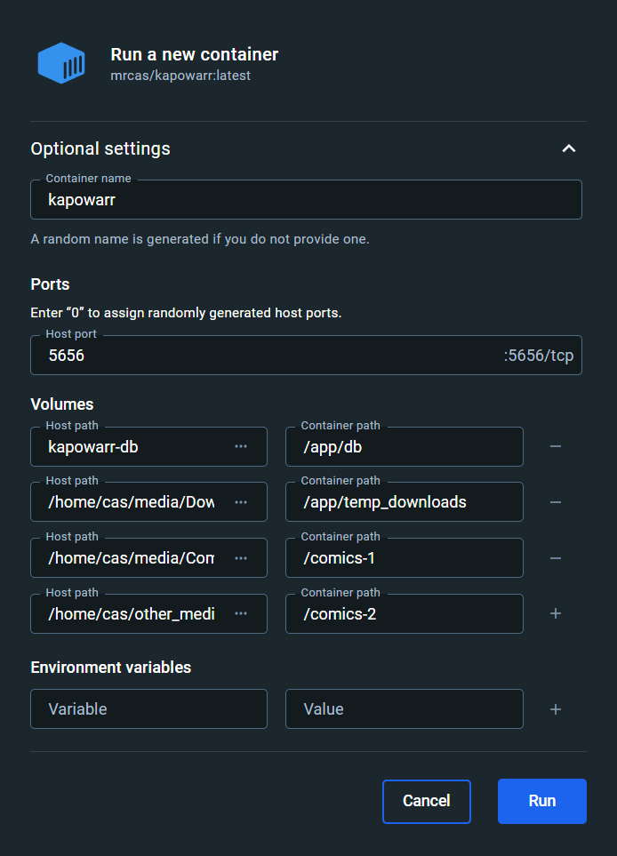

On this page, you can find instructions on how to install Kapowarr using Docker and how to update a Docker installation.

## Installation

### Install Docker

The first step is to install Docker, if you don't have it installed already. The official Docker documentation hub offers great instructions on [how to install docker CLI and Docker Desktop](https://docs.docker.com/engine/install/). Take notice of whether you installed the 'Docker CLI' (the Docker documentation also calls this 'Docker CE') or 'Docker Desktop', for future instructions.

??? info "Quick introduction to Docker"
	Docker allows you to create little virtual computers, called 'containers'. You can run an application inside these containers. This is useful because you decide how much resources these containers can use, and what access these applications get to "the outside". It makes it safer (e.g. the application only has access to folders on the computer that you explicitly give it access to), and makes installation easier (the developer makes sure that inside the container everything is setup properly, not you).
	
	Allowing folders and network connections through the container is done using 'mapping'. For example, you can map the folder `D:\Comics` on the host to the folder `/comics` inside the container. Then everything inside the host folder (`D:\Comics`) is visible to the application via the mapped container folder (`/comics`). Mapping network ports works in a similar manner.
	
	When you turn off a container, all file changes inside the container (e.g. folders/files added) are lost. This is so that the environment inside the container when starting up is always the same. So in order to save a file/folder permanently, it has to be stored on the host and then mapped to somewhere inside the container.

### Create place for the database

Kapowarr needs a permanent place to put the database file. This can be a [Docker volume](https://docs.docker.com/storage/volumes/) or a folder on the host machine.

=== "Docker Volume"
	=== "Docker CLI"

		```bash
		docker volume create kapowarr-db
		```

	=== "Docker Compose"

		```bash
		docker volume create kapowarr-db
		```

	=== "Docker Desktop"
		- Open `Volumes`
		- Click `Create`
		- Enter `kapowarr-db` for the name and click `Create`

=== "Local Folder"
	=== "Linux"
		Following the Linux standards, we suggest the folder `/opt/Kapowarr/db`. This is not mandatory however. You are allowed to create a folder anywhere you like.

		Create the desired folder using the UI (if your distro offers this) or with the following shell command (replace `/path/to/directory` with desired path):

		```bash
		mkdir "/path/to/directory"
		```

		The folder needs to offer read, write and execution permissions to the user that the container will run as. You can change the user that the container runs as using the PUID (user) and PGID (group) environment variables when launching the container later. The folder also needs to either be owned by that user, be owned by a group that the user is a part of or have sufficient permissions so that _any_ user can use the folder.

	=== "MacOS"
		Following MacOS standards, we suggest the folder `/Applications/Kapowarr/db`. This is not mandatory however. You are allowed to create a folder anywhere you like.

		Create the desired folder using the UI or with the following shell command (replace `/path/to/directory` with desired path):

		```bash
		mkdir "/path/to/directory"
		```

		The folder needs to offer read, write and execution permissions to the user that the container will run as. You can change the user that the container runs as using the PUID and PGID (for the group) environment variables when launching the container later. The folder also needs to either be owned by that user, be owned by a group that the user is a part of or have sufficient permissions so that _any_ user can use the folder.

	=== "Windows"
		There is no defined standard for Windows on where to put such a folder. We suggest a path like `C:\apps\Kapowarr\db` or `D:\Kapowarr\db`. This is not mandatory however. You are allowed to create a folder anywhere you like.

		Create the desired folder either using the Windows Explorer, or using the following Powershell command:

		```powershell
		mkdir "C:\path\to\directory"
		```

### Create a root folder

You need at least one folder that all media files can be stored in, called a [root folder](../settings/mediamanagement.md#root-folders). If you don't already have a folder with comics, then create one. The folder is allowed to be anywhere you like. You can create it using the same instructions as for [creating a folder for the database file](#__tabbed_1_2).

### Create a download folder

Kapowarr needs a [download folder](../settings/download.md#direct-download-temporary-folder). If you don't already have a folder that software can download to, then create one. The folder is allowed to be anywhere you like. You can create it using the same instructions as for [creating a folder for the database file](#__tabbed_1_2).

The database folder, root folder(s) and download folder can't intersect (e.g.: the download folder can't be inside the root folder).

### Launch container

Now we can launch the container.

=== "Docker CLI"
	The command to get the Docker container running can be found below. But before you copy, paste and run it, read the notes below!

	=== "Linux"

		```bash
		docker run -d \
			--name kapowarr \
			-v "kapowarr-db:/app/db" \
			-v "/path/to/download_folder:/app/temp_downloads" \
			-v "/path/to/root_folder:/comics" \
			-p 5656:5656 \
			-e PUID=0 \
			-e PGID=0 \
			-e TZ=Etc/UTC \
			mrcas/kapowarr:latest
		```

	=== "MacOS"

		```bash
		docker run -d \
			--name kapowarr \
			-v "kapowarr-db:/app/db" \
			-v "/path/to/download_folder:/app/temp_downloads" \
			-v "/path/to/root_folder:/comics" \
			-p 5656:5656 \
			-e PUID=0 \
			-e PGID=0 \
			-e TZ=Etc/UTC \
			mrcas/kapowarr:latest
		```

	=== "Windows"

		```powershell
		docker run -d --name kapowarr -v "kapowarr-db:/app/db" -v "DRIVE:\with\download_folder:/app/temp_downloads" -v "DRIVE:\with\root_folder:/comics" -p 5656:5656 -e PUID=0 -e PGID=0 -e TZ=Etc/UTC mrcas/kapowarr:latest
		```

	A few notes about this command:

	1. If you're using a folder on the host machine instead of a docker volume to store the database file, replace `kapowarr-db` with the path to the host folder. It's mapped to `/app/db` inside the container.

	!!! example "Examples"
		- `-v "/opt/Kapowarr/db:/app/db"`
		- `-v "C:\apps\Kapowarr\db:/app/db"`

	2. Replace `/path/to/download_folder` with the path to the download folder on the host. It's mapped to `/app/temp_downloads` inside the container.

	!!! example "Examples"
		- `-v "/home/my-user/comic-downloads:/app/temp_downloads"`
		- `-v "D:\Comics\Downloads:/app/temp_downloads"`

	3. Replace `/path/to/root_folder` with the path to the root folder on the host. It's mapped to `/comics` inside the container. So later, when Kapowarr is running and you need to add a root folder, the mapped folder is what you'll add (e.g. `/comics`).

	!!! example "Examples"
		- `-v "/home/my-user/comics:/comics"`
		- `-v "D:\Comics\Library:/comics"`

	4. You can map multiple root folders by repeating `-v "/path/to/root_folder:/comics"` (or `-v "DRIVE:\with\root_folder:/comics"` for Windows) in the command, but then supplying different values for `/path/to/root_folder` and `/comics`.
	
	!!! example "Examples"
		- `-v "/home/my-user/comics-2:/comics-2" \`
		- `-v "E:\Comics:/comics-2"`

	5. If you want to run Kapowarr on a different port, you can do that by replacing the left `5656` with the desired port.
	
	!!! example "Examples"
		- `-p 8009:5656` to be available on `8009`
		- `-p 443:5656` to be available on `443`
		- `-p 5656:5656` to be available on `5656`

	6. You can change the user and group that the application inside the container runs as using the PUID (user) and PGID (group) environment variables.
	
	7. Set the `TZ` environment variable to the [timezone database name](https://en.wikipedia.org/wiki/List_of_tz_database_time_zones#List) of your timezone (value of `TZ identifier` on webpage).

=== "Docker Compose"
	The contents of the `docker-compose.yml` file are below. The source file can also be found [on GitHub](https://github.com/Casvt/Kapowarr/blob/development/docker-compose.yml). But before you copy, paste and run it, read the notes below!

	```yml
	services:
		kapowarr:
			container_name: kapowarr
			image: mrcas/kapowarr:latest
			environment:
				- PUID=0
				- PGID=0
				- TZ=Etc/UTC
			volumes:
				- "kapowarr-db:/app/db"
				- "/path/to/download_folder:/app/temp_downloads"
				- "/path/to/comics:/comics"
			ports:
				- 5656:5656

	volumes:
		kapowarr-db:
	```

	Then run the following command to start the container. Run this command from within the directory where the `docker-compose.yml` file is located.

	```bash
	docker-compose up -d
	```	

	A few notes about the `docker-compose.yml` file:

	1.  If you're using a folder on the host machine instead of a docker volume to store the database file, replace `kapowarr-db` with the path to the host folder. It's mapped to `/app/db` inside the container.

	!!! example "Examples"
		- `- "/opt/Kapowarr/db:/app/db"`
		- `- "C:\apps\Kapowarr\db:/app/db"`

	2.  Replace `/path/to/download_folder` with the path to the download folder on the host. It's mapped to `/app/temp_downloads` inside the container.
	
	!!! example "Examples"
		- `- "/home/my-user/comic-downloads:/app/temp_downloads"`
		- `- "D:\Comics\Downloads:/app/temp_downloads"`

	3. Replace `/path/to/root_folder` with the path to the root folder on the host. It's mapped to `/comics` inside the container. So later, when Kapowarr is running and you need to add a root folder, the mapped folder is what you'll add (e.g. `/comics`).

	!!! example "Examples"
		- `- "/home/my-user/comics:/comics"`
		- `- "D:\Comics\Library:/comics"`

	4. You can map multiple root folders by repeating `- "/path/to/root_folder:/comics"` in the command, but then supplying different values for `/path/to/root_folder` and `/comics`.
	
	!!! example "Examples"
		- `- "/home/my-user/comics-2:/comics-2"`
		- `- "E:\Comics:/comics-2"`

	5. If you want to run Kapowarr on a different port, you can do that by replacing the left `5656` with the desired port.
	
	!!! example "Examples"
		- `- 8009:5656` to be available on `8009`
		- `- 443:5656` to be available on `443`
		- `- 5656:5656` to be available on `5656`

	6. You can change the user and group that the application inside the container runs as using the PUID (user) and PGID (group) environment variables.
	
	7. Set the `TZ` environment variable to the [timezone database name](https://en.wikipedia.org/wiki/List_of_tz_database_time_zones#List) of your timezone (value of `TZ identifier` on webpage).

=== "Docker Desktop"
	1. Click the search bar at the top and search for `mrcas/kapowarr`.

	2. Click `Run` on the entry saying `mrcas/kapowarr`.

	3. Open `Images`, and on the right, under `Actions` click the play/run button for `mrcas/kapowarr`.

	4. Expand the 'Optional settings'.

	5. For the `Container name`, set the value to `kapowarr`.

	6. For the `Host port`, set the value to `5656`. Set it to a different value if you want to run Kapowarr on a different port.

	7. For the `Host path`, set the value to `kapowarr-db` if you are using a Docker volume for the database. Otherwise, set it to the path to the folder on the host. Set the accompanying `Container path` to `/app/db`.

	8. Add another volume mapping using the plus button on the right. Enter the path to the download folder on the host as the value of `Host path` and set the accompanying `Container path` to `/app/temp_downloads`.

	9. Add another volume mapping using the plus button on the right. Enter the path to the root folder on the host as the value of `Host path` and set the accompanying `Container path` to `/comics`. Later, when Kapowarr is running and you need to add a root folder, the mapped folder is what you'll add (e.g. `/comics`).

	10. If you have multiple root folders, repeat step 9, but with a different value for `Host path` and `Container path`.

	11. Under `Environment Variables`, set the `Variable` field to `TZ` and the `Value` field to the [timezone database name](https://en.wikipedia.org/wiki/List_of_tz_database_time_zones#List) of your timezone (value of `TZ identifier` on webpage).
	
	12. You can change the user and group that the application inside the container runs as using the PUID (user) and PGID (group) environment variables. If so, add another environment variable using the plus button on the right. Set the `Variable` field to `PUID` and the `Value` field to the ID of the desired user. Add yet another environment variable using the plus button on the right. Set the `Variable` field to `PGID` and the `Value` field to the ID of the desired group.

### Example

Below you can find an example of launching the container.

=== "Docker CLI"
	```bash
	docker run -d \
		--name kapowarr \
		-v "kapowarr-db:/app/db" \
		-v "/home/cas/media/Downloads:/app/temp_downloads" \
		-v "/home/cas/media/Comics:/comics" \
		-v "/home/cas/other_media/Comics-2:/comics-2" \
		-p 5656:5656 \
		-e PUID=1000 \
		-e PGID=1000 \
		-e TZ=Europe/Amsterdam \
		mrcas/kapowarr:latest
	```

=== "Docker Compose"
	```yml
	services:
		kapowarr:
			container_name: kapowarr
			image: mrcas/kapowarr:latest
			environment:
				- PUID=1000
				- PGID=1000
				- TZ=Europe/Amsterdam
			volumes:
				- "kapowarr-db:/app/db"
				- "/home/cas/media/Downloads:/app/temp_downloads"
				- "/home/cas/media/Comics:/comics"
				- "/home/cas/other_media/Comics-2:/comics-2"
			ports:
				- 5656:5656

	volumes:
		kapowarr-db:
	```

=== "Docker Desktop"
	

* We use a Docker volume as the place to store the database file.
* We set `/home/cas/media/Downloads` as the download folder.
* We map the folder `/home/cas/media/Comics` to `/comics`.
* We map the folder `/home/cas/other_media/Comics-2` to `/comics-2`.
* We run the container as user 1000 and group 1000.
* We set the timezone to `Europe/Amsterdam`.

In Kapowarr we'd then add `/comics` and `/comics-2` as root folders.

### Check Setup After Installation

Now that the container is up and running, check out the [Setup After Installation] page for instructions on how to configure Kapowarr so that it works properly.

## Updating

Below you can find instructions on how to update an install. In order for the database to properly migrate, upgrade minor version by minor version (i.e. v1.0.0, v1.1.0, v1.2.0, etc.).

=== "Docker CLI"
	If needed, run these commands with `sudo`. It is assumed that the name of the container is `kapowarr` (which is set using the `--name` option in the command).

	1. `docker container stop kapowarr`
	2. `docker container rm kapowarr`
	3. `docker image rm mrcas/kapowarr:latest`
	4. Repeat the steps of [launching the container](#launch-container).

=== "Docker Compose"
	If needed, run these commands with `sudo`. You need to be in the same directory as the `docker-compose.yml` file when running these commands.
	
	1. `docker-compose down`
	2. `docker-compose pull`
	3. `docker-compose up -d`
	4. `docker image prune -f`

=== "Docker Desktop"
	1. Open `Containers` and locate the `kapowarr` container in the list.
	2. Click the stop button on the right, then the delete button.
	3. Open `Images` and locate the `mrcas/kapowarr` image in the list.
	4. Click the delete button on the right.
	5. Repeat the steps of [launching the container](#launch-container).
